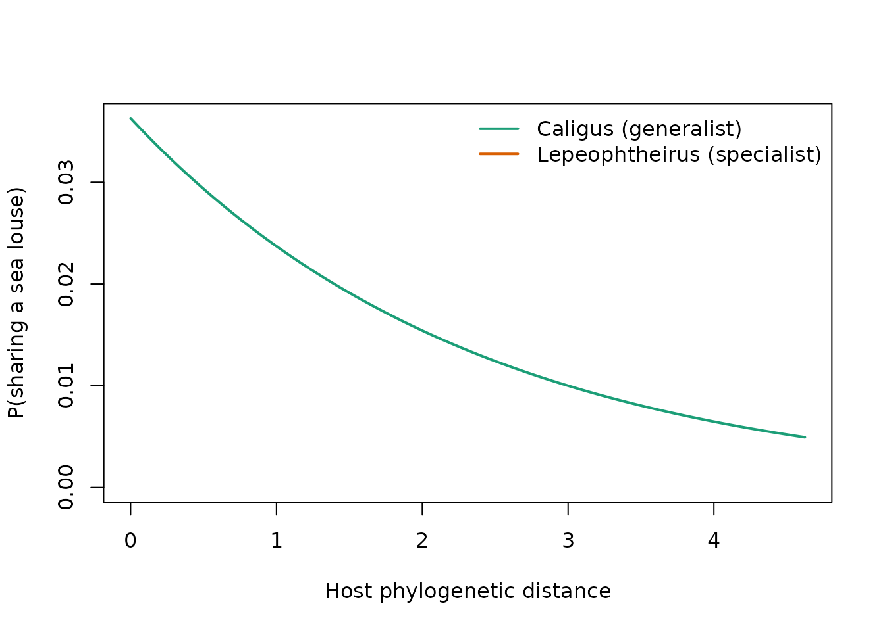

# Comparing clades: Caligus vs Lepeophtheirus sea lice on marine fishes

This vignette shows the full phylopred v2 workflow on a real
host-parasite system: sea lice (Copepoda: Caligidae) parasitizing marine
fishes. We ask whether the probability that two fish species share a sea
louse decays faster with host phylogenetic distance in *Lepeophtheirus*
than in *Caligus* — i.e., whether *Lepeophtheirus* is a phylogenetic
specialist and *Caligus* a generalist.

Interaction records come from the
[cofid](https://github.com/alrobles/cofid) package (copepod-fish
interaction database) and the host phylogeny from the [Fish Tree of
Life](https://fishtreeoflife.org/) (Rabosky et al. 2018), pruned to the
recorded hosts and shipped as the `fish_tree` data object.

``` r

library(phylopred)
library(ape)
```

## 1. Interaction data

We keep one record per copepod species / fish species pair and derive
the copepod genus, which is the clade-level grouping we want to compare.

``` r

interactions <- cofid::cofid
interactions$genus <- sub(" .*", "", interactions$source_taxon_name)
interactions <- interactions[
  interactions$genus %in% c("Caligus", "Lepeophtheirus"),
  c("source_taxon_name", "target_taxon_name", "genus")
]
table(unique(interactions[, c("source_taxon_name", "genus")])$genus)
#> 
#>        Caligus Lepeophtheirus 
#>            223             99
```

## 2. Host phylogenetic distances

`fish_tree` is already pruned to the recorded hosts present in the Fish
Tree of Life; its cophenetic matrix gives the phylogenetic distance
between every pair of hosts.

``` r

data(fish_tree)
phydist <- cophenetic(fish_tree)
dim(phydist)
#> [1] 625 625
```

## 3. Pairwise host-sharing data

[`prepare_pair_data()`](https://alrobles.github.io/phylopred/reference/prepare_pair_data.md)
expands the interaction table into all (focal host, target host) pairs
per parasite. Every known host is used as a focal host — unlike the
legacy workflow, which sampled a single focal host per parasite — so the
data set is deterministic and uses all available information.

``` r

pairs <- prepare_pair_data(interactions, phydist, group = "genus")
#> Warning in prepare_pair_data(interactions, phydist, group = "genus"): 309
#> interaction record(s) dropped: host not in 'phydist'.
nrow(pairs)
#> [1] 788112
head(pairs)
#>         parasite                    focal                 target  phydist
#> 1 Caligus absens Priacanthus macracanthus       Fundulus majalis 1.681117
#> 2 Caligus absens Priacanthus macracanthus Cypselurus callopterus 1.315368
#> 3 Caligus absens Priacanthus macracanthus    Hyporhamphus sajori 1.483426
#> 4 Caligus absens Priacanthus macracanthus     Belone svetovidovi 1.354719
#> 5 Caligus absens Priacanthus macracanthus          Belone belone 1.342299
#> 6 Caligus absens Priacanthus macracanthus        Cololabis saira 1.366091
#>   suscept   group
#> 1       0 Caligus
#> 2       0 Caligus
#> 3       0 Caligus
#> 4       0 Caligus
#> 5       0 Caligus
#> 6       0 Caligus
```

## 4. Comparing slopes between clades

[`compare_phylopred_slopes()`](https://alrobles.github.io/phylopred/reference/compare_phylopred_slopes.md)
fits a single logistic regression with a genus-by-distance interaction
and quantifies uncertainty with a parasite-level cluster bootstrap,
which respects the non-independence of pairs that share a parasite.

``` r

cmp <- compare_phylopred_slopes(pairs, n_boot = 20, seed = 42)
cmp
#> Phylopred slope comparison: Caligus vs Lepeophtheirus 
#> Slope Caligus: -0.4386  [-1.0162, 0.0045]
#> Slope Lepeophtheirus: -0.5690  [-2.0191, -0.3069]
#> Difference: -0.1304  [-1.6878, 0.3232]  (Wald p = 0.00565)
```

A more negative slope means the probability of sharing a parasite decays
faster with phylogenetic distance. The *Lepeophtheirus* slope is steeper
than the *Caligus* slope and the interaction term is negative,
supporting the interpretation of *Lepeophtheirus* as a phylogenetic
specialist and *Caligus* as a generalist.

## 5. Predicted sharing curves

``` r

cf <- coef(cmp$fitted_model)
d <- seq(0, max(pairs$phydist), length.out = 200)
p_cal <- plogis(cf["(Intercept)"] + cf["phydist"] * d)
p_lep <- plogis(cf["(Intercept)"] + cf["genusLepeophtheirus"] +
                  (cf["phydist"] + cf["phydist:genusLepeophtheirus"]) * d)
plot(d, p_cal, type = "l", col = "#1b9e77", lwd = 2, ylim = c(0, max(p_cal)),
     xlab = "Host phylogenetic distance",
     ylab = "P(sharing a sea louse)")
lines(d, p_lep, col = "#d95f02", lwd = 2)
legend("topright", legend = c("Caligus (generalist)",
                              "Lepeophtheirus (specialist)"),
       col = c("#1b9e77", "#d95f02"), lwd = 2, bty = "n")
```



## 6. Model capacity and joint uncertainty

[`evaluate_phylopred_model()`](https://alrobles.github.io/phylopred/reference/evaluate_phylopred_model.md)
reports pseudo-R² and AUC (optionally with a parasite-grouped
cross-validation, which measures the ability to predict the host range
of unseen parasites), and
[`phylopred_confidence_ellipse()`](https://alrobles.github.io/phylopred/reference/phylopred_confidence_ellipse.md)
gives the joint confidence region of intercept and slope from the
cluster bootstrap.

``` r

evaluate_phylopred_model(pairs)
#> Warning in n1 * n0: NAs produced by integer overflow
#> Phylopred model evaluation
#> Pairs: 788112  Parasites: 299
#> McFadden pseudo-R2: 0.0150
#> Tjur R2:            0.0030
#> AUC (in-sample):    NA
```

``` r

ell <- phylopred_confidence_ellipse(cmp$bootstrap)
plot(ell, type = "l",
     main = "95% joint confidence ellipse (cluster bootstrap)")
points(t(attr(ell, "center")), pch = 19)
```


## 7. Presence-only threshold metrics: f_gamma and partial ROC

Interaction data are presence-only: unrecorded host-parasite pairs are
unlabeled, not true absences.
[`host_threshold_metric()`](https://alrobles.github.io/phylopred/reference/host_threshold_metric.md)
adapts the SDM threshold metric $`f_\gamma(t) = a/(\gamma b + c)`$ to
phylogenies — `a` is the sensitivity over known hosts and `b` the
fraction of all species in the phylogeny predicted as hosts — and
[`phylo_partial_roc()`](https://alrobles.github.io/phylopred/reference/phylo_partial_roc.md)
gives the Peterson-Papes-Soberon partial AUC ratio against a null
(random-ranking) model.

``` r

fit <- glm(suscept ~ phydist, data = pairs, family = binomial())
example_parasite <- names(sort(table(pairs$parasite), decreasing = TRUE))[1]
one <- pairs[pairs$parasite == example_parasite, ]
one$pred <- predict(fit, newdata = one, type = "response")
# Suitability of each target species: best score across the parasite's
# known focal hosts
agg <- aggregate(cbind(pred, suscept) ~ target, data = one, FUN = max)

m <- host_threshold_metric(agg$pred, agg$suscept, gamma = 1)
m
#> Phylopred threshold metric f_gamma (gamma = 1)
#> Optimal threshold: 0.0260  f_gamma: 1.5328
#> Evaluated at 610 thresholds.
plot(m)
```


With `gamma = 1`, `f_gamma` can be read as a phylogenetic efficiency:
known hosts retained per unit of phylogeny predicted as suitable.

In Peterson, Papes & Soberon (2008) the tolerance `E` bounds the
omission error on the y axis, motivated by the known georeferencing /
identification error of occurrence databases. For interaction records we
do not know that error, so `E` is simply the omission we are willing to
tolerate; a large value (here `E = 0.95`) uses essentially the whole
curve, so the ratio compares the full presence-only AUC against the
random-ranking null.

``` r

roc <- phylo_partial_roc(agg$pred, agg$suscept, error_rate = 0.95,
                         n_boot = 200, seed = 42)
roc
#> Phylopred phylogenetic partial ROC (E = 0.95)
#> Partial AUC ratio: 1.5032
#> Bootstrap p-value (ratio <= 1): 0.0000  [200 replicates]
plot(roc)
```


## 8. Positive-unlabeled prediction with xplus

The pairwise GLM scores every candidate host through a parametric curve
in phylogenetic distance.
[`fit_phylopred_pu()`](https://alrobles.github.io/phylopred/reference/fit_phylopred_pu.md)
is a parallel, non-parametric route: known hosts of one parasite are the
positives, every other tip of the phylogeny is unlabeled (not a
confirmed absence), and an iterative PU learner (`xplus`) is trained on
phylogenetic features (minimum and mean distance to the known hosts plus
PCoA axes of the tree).

``` r

pu <- fit_phylopred_pu(interactions, phydist, example_parasite,
                    seed = 42, max_iter = 30)
#> Warning: from glmnet C++ code (error code -73); Convergence for 73th lambda
#> value not reached after maxit=100000 iterations; solutions for larger lambdas
#> returned
#> Warning: from glmnet C++ code (error code -92); Convergence for 92th lambda
#> value not reached after maxit=100000 iterations; solutions for larger lambdas
#> returned
#> Warning: from glmnet C++ code (error code -82); Convergence for 82th lambda
#> value not reached after maxit=100000 iterations; solutions for larger lambdas
#> returned
#> Warning: from glmnet C++ code (error code -88); Convergence for 88th lambda
#> value not reached after maxit=100000 iterations; solutions for larger lambdas
#> returned
#> Warning: from glmnet C++ code (error code -88); Convergence for 88th lambda
#> value not reached after maxit=100000 iterations; solutions for larger lambdas
#> returned
#> Warning: from glmnet C++ code (error code -88); Convergence for 88th lambda
#> value not reached after maxit=100000 iterations; solutions for larger lambdas
#> returned
#> Warning: from glmnet C++ code (error code -85); Convergence for 85th lambda
#> value not reached after maxit=100000 iterations; solutions for larger lambdas
#> returned
#> Warning: from glmnet C++ code (error code -83); Convergence for 83th lambda
#> value not reached after maxit=100000 iterations; solutions for larger lambdas
#> returned
#> Warning: from glmnet C++ code (error code -80); Convergence for 80th lambda
#> value not reached after maxit=100000 iterations; solutions for larger lambdas
#> returned
#> Warning: from glmnet C++ code (error code -79); Convergence for 79th lambda
#> value not reached after maxit=100000 iterations; solutions for larger lambdas
#> returned
#> Warning: from glmnet C++ code (error code -87); Convergence for 87th lambda
#> value not reached after maxit=100000 iterations; solutions for larger lambdas
#> returned
#> Warning: from glmnet C++ code (error code -92); Convergence for 92th lambda
#> value not reached after maxit=100000 iterations; solutions for larger lambdas
#> returned
#> Warning: from glmnet C++ code (error code -92); Convergence for 92th lambda
#> value not reached after maxit=100000 iterations; solutions for larger lambdas
#> returned
#> Warning: from glmnet C++ code (error code -84); Convergence for 84th lambda
#> value not reached after maxit=100000 iterations; solutions for larger lambdas
#> returned
#> Warning: from glmnet C++ code (error code -83); Convergence for 83th lambda
#> value not reached after maxit=100000 iterations; solutions for larger lambdas
#> returned
#> Warning: from glmnet C++ code (error code -79); Convergence for 79th lambda
#> value not reached after maxit=100000 iterations; solutions for larger lambdas
#> returned
#> Warning: from glmnet C++ code (error code -91); Convergence for 91th lambda
#> value not reached after maxit=100000 iterations; solutions for larger lambdas
#> returned
#> Warning: from glmnet C++ code (error code -81); Convergence for 81th lambda
#> value not reached after maxit=100000 iterations; solutions for larger lambdas
#> returned
#> Warning: from glmnet C++ code (error code -84); Convergence for 84th lambda
#> value not reached after maxit=100000 iterations; solutions for larger lambdas
#> returned
#> Warning: from glmnet C++ code (error code -76); Convergence for 76th lambda
#> value not reached after maxit=100000 iterations; solutions for larger lambdas
#> returned
#> Warning: from glmnet C++ code (error code -81); Convergence for 81th lambda
#> value not reached after maxit=100000 iterations; solutions for larger lambdas
#> returned
pu
#> Phylopred PU-learning host prediction (xplus/PLUS)
#> Parasite: Caligus elongatus
#> Known hosts: 47 of 625 species
#> Iterations: 30 (stop: max_iter)
m_pu <- host_threshold_metric(pu$prediction$pred, pu$prediction$is_host)
roc_pu <- phylo_partial_roc(pu$prediction$pred, pu$prediction$is_host,
                            error_rate = 0.95, n_boot = 200, seed = 42)
roc_pu
#> Phylopred phylogenetic partial ROC (E = 0.95)
#> Partial AUC ratio: 1.6593
#> Bootstrap p-value (ratio <= 1): 0.0000  [200 replicates]
```

Because the unlabeled species are not true absences, in-sample
classification metrics overstate performance.
[`validate_host_prediction()`](https://alrobles.github.io/phylopred/reference/validate_host_prediction.md)
hides a fraction of the known hosts, refits, and measures how well the
model ranks the hidden hosts above truly unlabeled species:

``` r

validate_host_prediction(interactions, phydist, example_parasite,
                         method = "glm", n_rep = 5, seed = 42)
#> Phylopred leave-hosts-out validation (glm)
#> Parasite: Caligus elongatus
#> Holdout AUC (hidden hosts vs unlabeled): mean 0.778 over 5 reps [0.689, 0.854]
validate_host_prediction(interactions, phydist, example_parasite,
                         method = "pu", n_rep = 5, seed = 42, max_iter = 20)
#> Warning: from glmnet C++ code (error code -73); Convergence for 73th lambda
#> value not reached after maxit=100000 iterations; solutions for larger lambdas
#> returned
#> Warning: from glmnet C++ code (error code -88); Convergence for 88th lambda
#> value not reached after maxit=100000 iterations; solutions for larger lambdas
#> returned
#> Warning: from glmnet C++ code (error code -88); Convergence for 88th lambda
#> value not reached after maxit=100000 iterations; solutions for larger lambdas
#> returned
#> Warning: from glmnet C++ code (error code -82); Convergence for 82th lambda
#> value not reached after maxit=100000 iterations; solutions for larger lambdas
#> returned
#> Warning: from glmnet C++ code (error code -75); Convergence for 75th lambda
#> value not reached after maxit=100000 iterations; solutions for larger lambdas
#> returned
#> Warning: from glmnet C++ code (error code -86); Convergence for 86th lambda
#> value not reached after maxit=100000 iterations; solutions for larger lambdas
#> returned
#> Warning: from glmnet C++ code (error code -77); Convergence for 77th lambda
#> value not reached after maxit=100000 iterations; solutions for larger lambdas
#> returned
#> Warning: from glmnet C++ code (error code -73); Convergence for 73th lambda
#> value not reached after maxit=100000 iterations; solutions for larger lambdas
#> returned
#> Warning: from glmnet C++ code (error code -78); Convergence for 78th lambda
#> value not reached after maxit=100000 iterations; solutions for larger lambdas
#> returned
#> Warning: from glmnet C++ code (error code -82); Convergence for 82th lambda
#> value not reached after maxit=100000 iterations; solutions for larger lambdas
#> returned
#> Warning: from glmnet C++ code (error code -83); Convergence for 83th lambda
#> value not reached after maxit=100000 iterations; solutions for larger lambdas
#> returned
#> Warning: from glmnet C++ code (error code -75); Convergence for 75th lambda
#> value not reached after maxit=100000 iterations; solutions for larger lambdas
#> returned
#> Warning: from glmnet C++ code (error code -86); Convergence for 86th lambda
#> value not reached after maxit=100000 iterations; solutions for larger lambdas
#> returned
#> Warning: from glmnet C++ code (error code -95); Convergence for 95th lambda
#> value not reached after maxit=100000 iterations; solutions for larger lambdas
#> returned
#> Warning: from glmnet C++ code (error code -90); Convergence for 90th lambda
#> value not reached after maxit=100000 iterations; solutions for larger lambdas
#> returned
#> Warning: from glmnet C++ code (error code -68); Convergence for 68th lambda
#> value not reached after maxit=100000 iterations; solutions for larger lambdas
#> returned
#> Warning: from glmnet C++ code (error code -84); Convergence for 84th lambda
#> value not reached after maxit=100000 iterations; solutions for larger lambdas
#> returned
#> Warning: from glmnet C++ code (error code -76); Convergence for 76th lambda
#> value not reached after maxit=100000 iterations; solutions for larger lambdas
#> returned
#> Warning: from glmnet C++ code (error code -80); Convergence for 80th lambda
#> value not reached after maxit=100000 iterations; solutions for larger lambdas
#> returned
#> Warning: from glmnet C++ code (error code -76); Convergence for 76th lambda
#> value not reached after maxit=100000 iterations; solutions for larger lambdas
#> returned
#> Warning: from glmnet C++ code (error code -58); Convergence for 58th lambda
#> value not reached after maxit=100000 iterations; solutions for larger lambdas
#> returned
#> Warning: from glmnet C++ code (error code -72); Convergence for 72th lambda
#> value not reached after maxit=100000 iterations; solutions for larger lambdas
#> returned
#> Warning: from glmnet C++ code (error code -85); Convergence for 85th lambda
#> value not reached after maxit=100000 iterations; solutions for larger lambdas
#> returned
#> Warning: from glmnet C++ code (error code -98); Convergence for 98th lambda
#> value not reached after maxit=100000 iterations; solutions for larger lambdas
#> returned
#> Warning: from glmnet C++ code (error code -90); Convergence for 90th lambda
#> value not reached after maxit=100000 iterations; solutions for larger lambdas
#> returned
#> Warning: from glmnet C++ code (error code -79); Convergence for 79th lambda
#> value not reached after maxit=100000 iterations; solutions for larger lambdas
#> returned
#> Warning: from glmnet C++ code (error code -69); Convergence for 69th lambda
#> value not reached after maxit=100000 iterations; solutions for larger lambdas
#> returned
#> Warning: from glmnet C++ code (error code -60); Convergence for 60th lambda
#> value not reached after maxit=100000 iterations; solutions for larger lambdas
#> returned
#> Warning: from glmnet C++ code (error code -95); Convergence for 95th lambda
#> value not reached after maxit=100000 iterations; solutions for larger lambdas
#> returned
#> Warning: from glmnet C++ code (error code -84); Convergence for 84th lambda
#> value not reached after maxit=100000 iterations; solutions for larger lambdas
#> returned
#> Warning: from glmnet C++ code (error code -78); Convergence for 78th lambda
#> value not reached after maxit=100000 iterations; solutions for larger lambdas
#> returned
#> Warning: from glmnet C++ code (error code -77); Convergence for 77th lambda
#> value not reached after maxit=100000 iterations; solutions for larger lambdas
#> returned
#> Warning: from glmnet C++ code (error code -75); Convergence for 75th lambda
#> value not reached after maxit=100000 iterations; solutions for larger lambdas
#> returned
#> Warning: from glmnet C++ code (error code -93); Convergence for 93th lambda
#> value not reached after maxit=100000 iterations; solutions for larger lambdas
#> returned
#> Warning: from glmnet C++ code (error code -68); Convergence for 68th lambda
#> value not reached after maxit=100000 iterations; solutions for larger lambdas
#> returned
#> Warning: from glmnet C++ code (error code -83); Convergence for 83th lambda
#> value not reached after maxit=100000 iterations; solutions for larger lambdas
#> returned
#> Warning: from glmnet C++ code (error code -88); Convergence for 88th lambda
#> value not reached after maxit=100000 iterations; solutions for larger lambdas
#> returned
#> Warning: from glmnet C++ code (error code -85); Convergence for 85th lambda
#> value not reached after maxit=100000 iterations; solutions for larger lambdas
#> returned
#> Warning: from glmnet C++ code (error code -86); Convergence for 86th lambda
#> value not reached after maxit=100000 iterations; solutions for larger lambdas
#> returned
#> Warning: from glmnet C++ code (error code -78); Convergence for 78th lambda
#> value not reached after maxit=100000 iterations; solutions for larger lambdas
#> returned
#> Warning: from glmnet C++ code (error code -82); Convergence for 82th lambda
#> value not reached after maxit=100000 iterations; solutions for larger lambdas
#> returned
#> Warning: from glmnet C++ code (error code -82); Convergence for 82th lambda
#> value not reached after maxit=100000 iterations; solutions for larger lambdas
#> returned
#> Warning: from glmnet C++ code (error code -60); Convergence for 60th lambda
#> value not reached after maxit=100000 iterations; solutions for larger lambdas
#> returned
#> Warning: from glmnet C++ code (error code -80); Convergence for 80th lambda
#> value not reached after maxit=100000 iterations; solutions for larger lambdas
#> returned
#> Warning: from glmnet C++ code (error code -75); Convergence for 75th lambda
#> value not reached after maxit=100000 iterations; solutions for larger lambdas
#> returned
#> Warning: from glmnet C++ code (error code -83); Convergence for 83th lambda
#> value not reached after maxit=100000 iterations; solutions for larger lambdas
#> returned
#> Warning: from glmnet C++ code (error code -74); Convergence for 74th lambda
#> value not reached after maxit=100000 iterations; solutions for larger lambdas
#> returned
#> Warning: from glmnet C++ code (error code -84); Convergence for 84th lambda
#> value not reached after maxit=100000 iterations; solutions for larger lambdas
#> returned
#> Warning: from glmnet C++ code (error code -77); Convergence for 77th lambda
#> value not reached after maxit=100000 iterations; solutions for larger lambdas
#> returned
#> Warning: from glmnet C++ code (error code -80); Convergence for 80th lambda
#> value not reached after maxit=100000 iterations; solutions for larger lambdas
#> returned
#> Warning: from glmnet C++ code (error code -67); Convergence for 67th lambda
#> value not reached after maxit=100000 iterations; solutions for larger lambdas
#> returned
#> Warning: from glmnet C++ code (error code -88); Convergence for 88th lambda
#> value not reached after maxit=100000 iterations; solutions for larger lambdas
#> returned
#> Warning: from glmnet C++ code (error code -74); Convergence for 74th lambda
#> value not reached after maxit=100000 iterations; solutions for larger lambdas
#> returned
#> Warning: from glmnet C++ code (error code -99); Convergence for 99th lambda
#> value not reached after maxit=100000 iterations; solutions for larger lambdas
#> returned
#> Warning: from glmnet C++ code (error code -77); Convergence for 77th lambda
#> value not reached after maxit=100000 iterations; solutions for larger lambdas
#> returned
#> Warning: from glmnet C++ code (error code -89); Convergence for 89th lambda
#> value not reached after maxit=100000 iterations; solutions for larger lambdas
#> returned
#> Warning: from glmnet C++ code (error code -81); Convergence for 81th lambda
#> value not reached after maxit=100000 iterations; solutions for larger lambdas
#> returned
#> Warning: from glmnet C++ code (error code -85); Convergence for 85th lambda
#> value not reached after maxit=100000 iterations; solutions for larger lambdas
#> returned
#> Warning: from glmnet C++ code (error code -85); Convergence for 85th lambda
#> value not reached after maxit=100000 iterations; solutions for larger lambdas
#> returned
#> Warning: from glmnet C++ code (error code -79); Convergence for 79th lambda
#> value not reached after maxit=100000 iterations; solutions for larger lambdas
#> returned
#> Warning: from glmnet C++ code (error code -82); Convergence for 82th lambda
#> value not reached after maxit=100000 iterations; solutions for larger lambdas
#> returned
#> Warning: from glmnet C++ code (error code -80); Convergence for 80th lambda
#> value not reached after maxit=100000 iterations; solutions for larger lambdas
#> returned
#> Warning: from glmnet C++ code (error code -80); Convergence for 80th lambda
#> value not reached after maxit=100000 iterations; solutions for larger lambdas
#> returned
#> Warning: from glmnet C++ code (error code -77); Convergence for 77th lambda
#> value not reached after maxit=100000 iterations; solutions for larger lambdas
#> returned
#> Warning: from glmnet C++ code (error code -94); Convergence for 94th lambda
#> value not reached after maxit=100000 iterations; solutions for larger lambdas
#> returned
#> Warning: from glmnet C++ code (error code -79); Convergence for 79th lambda
#> value not reached after maxit=100000 iterations; solutions for larger lambdas
#> returned
#> Warning: from glmnet C++ code (error code -84); Convergence for 84th lambda
#> value not reached after maxit=100000 iterations; solutions for larger lambdas
#> returned
#> Warning: from glmnet C++ code (error code -87); Convergence for 87th lambda
#> value not reached after maxit=100000 iterations; solutions for larger lambdas
#> returned
#> Warning: from glmnet C++ code (error code -82); Convergence for 82th lambda
#> value not reached after maxit=100000 iterations; solutions for larger lambdas
#> returned
#> Warning: from glmnet C++ code (error code -91); Convergence for 91th lambda
#> value not reached after maxit=100000 iterations; solutions for larger lambdas
#> returned
#> Warning: from glmnet C++ code (error code -93); Convergence for 93th lambda
#> value not reached after maxit=100000 iterations; solutions for larger lambdas
#> returned
#> Warning: from glmnet C++ code (error code -96); Convergence for 96th lambda
#> value not reached after maxit=100000 iterations; solutions for larger lambdas
#> returned
#> Warning: from glmnet C++ code (error code -80); Convergence for 80th lambda
#> value not reached after maxit=100000 iterations; solutions for larger lambdas
#> returned
#> Warning: from glmnet C++ code (error code -92); Convergence for 92th lambda
#> value not reached after maxit=100000 iterations; solutions for larger lambdas
#> returned
#> Warning: from glmnet C++ code (error code -85); Convergence for 85th lambda
#> value not reached after maxit=100000 iterations; solutions for larger lambdas
#> returned
#> Warning: from glmnet C++ code (error code -97); Convergence for 97th lambda
#> value not reached after maxit=100000 iterations; solutions for larger lambdas
#> returned
#> Warning: from glmnet C++ code (error code -93); Convergence for 93th lambda
#> value not reached after maxit=100000 iterations; solutions for larger lambdas
#> returned
#> Warning: from glmnet C++ code (error code -85); Convergence for 85th lambda
#> value not reached after maxit=100000 iterations; solutions for larger lambdas
#> returned
#> Warning: from glmnet C++ code (error code -86); Convergence for 86th lambda
#> value not reached after maxit=100000 iterations; solutions for larger lambdas
#> returned
#> Warning: from glmnet C++ code (error code -84); Convergence for 84th lambda
#> value not reached after maxit=100000 iterations; solutions for larger lambdas
#> returned
#> Warning: from glmnet C++ code (error code -84); Convergence for 84th lambda
#> value not reached after maxit=100000 iterations; solutions for larger lambdas
#> returned
#> Warning: from glmnet C++ code (error code -85); Convergence for 85th lambda
#> value not reached after maxit=100000 iterations; solutions for larger lambdas
#> returned
#> Warning: from glmnet C++ code (error code -84); Convergence for 84th lambda
#> value not reached after maxit=100000 iterations; solutions for larger lambdas
#> returned
#> Warning: from glmnet C++ code (error code -86); Convergence for 86th lambda
#> value not reached after maxit=100000 iterations; solutions for larger lambdas
#> returned
#> Warning: from glmnet C++ code (error code -75); Convergence for 75th lambda
#> value not reached after maxit=100000 iterations; solutions for larger lambdas
#> returned
#> Warning: from glmnet C++ code (error code -94); Convergence for 94th lambda
#> value not reached after maxit=100000 iterations; solutions for larger lambdas
#> returned
#> Warning: from glmnet C++ code (error code -74); Convergence for 74th lambda
#> value not reached after maxit=100000 iterations; solutions for larger lambdas
#> returned
#> Warning: from glmnet C++ code (error code -87); Convergence for 87th lambda
#> value not reached after maxit=100000 iterations; solutions for larger lambdas
#> returned
#> Warning: from glmnet C++ code (error code -80); Convergence for 80th lambda
#> value not reached after maxit=100000 iterations; solutions for larger lambdas
#> returned
#> Warning: from glmnet C++ code (error code -72); Convergence for 72th lambda
#> value not reached after maxit=100000 iterations; solutions for larger lambdas
#> returned
#> Warning: from glmnet C++ code (error code -82); Convergence for 82th lambda
#> value not reached after maxit=100000 iterations; solutions for larger lambdas
#> returned
#> Warning: from glmnet C++ code (error code -71); Convergence for 71th lambda
#> value not reached after maxit=100000 iterations; solutions for larger lambdas
#> returned
#> Warning: from glmnet C++ code (error code -80); Convergence for 80th lambda
#> value not reached after maxit=100000 iterations; solutions for larger lambdas
#> returned
#> Warning: from glmnet C++ code (error code -77); Convergence for 77th lambda
#> value not reached after maxit=100000 iterations; solutions for larger lambdas
#> returned
#> Warning: from glmnet C++ code (error code -94); Convergence for 94th lambda
#> value not reached after maxit=100000 iterations; solutions for larger lambdas
#> returned
#> Warning: from glmnet C++ code (error code -72); Convergence for 72th lambda
#> value not reached after maxit=100000 iterations; solutions for larger lambdas
#> returned
#> Warning: from glmnet C++ code (error code -70); Convergence for 70th lambda
#> value not reached after maxit=100000 iterations; solutions for larger lambdas
#> returned
#> Warning: from glmnet C++ code (error code -98); Convergence for 98th lambda
#> value not reached after maxit=100000 iterations; solutions for larger lambdas
#> returned
#> Warning: from glmnet C++ code (error code -74); Convergence for 74th lambda
#> value not reached after maxit=100000 iterations; solutions for larger lambdas
#> returned
#> Warning: from glmnet C++ code (error code -90); Convergence for 90th lambda
#> value not reached after maxit=100000 iterations; solutions for larger lambdas
#> returned
#> Warning: from glmnet C++ code (error code -91); Convergence for 91th lambda
#> value not reached after maxit=100000 iterations; solutions for larger lambdas
#> returned
#> Warning: from glmnet C++ code (error code -88); Convergence for 88th lambda
#> value not reached after maxit=100000 iterations; solutions for larger lambdas
#> returned
#> Warning: from glmnet C++ code (error code -80); Convergence for 80th lambda
#> value not reached after maxit=100000 iterations; solutions for larger lambdas
#> returned
#> Warning: from glmnet C++ code (error code -82); Convergence for 82th lambda
#> value not reached after maxit=100000 iterations; solutions for larger lambdas
#> returned
#> Warning: from glmnet C++ code (error code -96); Convergence for 96th lambda
#> value not reached after maxit=100000 iterations; solutions for larger lambdas
#> returned
#> Warning: from glmnet C++ code (error code -55); Convergence for 55th lambda
#> value not reached after maxit=100000 iterations; solutions for larger lambdas
#> returned
#> Warning: from glmnet C++ code (error code -82); Convergence for 82th lambda
#> value not reached after maxit=100000 iterations; solutions for larger lambdas
#> returned
#> Warning: from glmnet C++ code (error code -97); Convergence for 97th lambda
#> value not reached after maxit=100000 iterations; solutions for larger lambdas
#> returned
#> Warning: from glmnet C++ code (error code -77); Convergence for 77th lambda
#> value not reached after maxit=100000 iterations; solutions for larger lambdas
#> returned
#> Warning: from glmnet C++ code (error code -86); Convergence for 86th lambda
#> value not reached after maxit=100000 iterations; solutions for larger lambdas
#> returned
#> Warning: from glmnet C++ code (error code -76); Convergence for 76th lambda
#> value not reached after maxit=100000 iterations; solutions for larger lambdas
#> returned
#> Warning: from glmnet C++ code (error code -82); Convergence for 82th lambda
#> value not reached after maxit=100000 iterations; solutions for larger lambdas
#> returned
#> Warning: from glmnet C++ code (error code -100); Convergence for 100th lambda
#> value not reached after maxit=100000 iterations; solutions for larger lambdas
#> returned
#> Warning: from glmnet C++ code (error code -84); Convergence for 84th lambda
#> value not reached after maxit=100000 iterations; solutions for larger lambdas
#> returned
#> Warning: from glmnet C++ code (error code -78); Convergence for 78th lambda
#> value not reached after maxit=100000 iterations; solutions for larger lambdas
#> returned
#> Warning: from glmnet C++ code (error code -97); Convergence for 97th lambda
#> value not reached after maxit=100000 iterations; solutions for larger lambdas
#> returned
#> Warning: from glmnet C++ code (error code -76); Convergence for 76th lambda
#> value not reached after maxit=100000 iterations; solutions for larger lambdas
#> returned
#> Warning: from glmnet C++ code (error code -75); Convergence for 75th lambda
#> value not reached after maxit=100000 iterations; solutions for larger lambdas
#> returned
#> Warning: from glmnet C++ code (error code -92); Convergence for 92th lambda
#> value not reached after maxit=100000 iterations; solutions for larger lambdas
#> returned
#> Warning: from glmnet C++ code (error code -89); Convergence for 89th lambda
#> value not reached after maxit=100000 iterations; solutions for larger lambdas
#> returned
#> Warning: from glmnet C++ code (error code -82); Convergence for 82th lambda
#> value not reached after maxit=100000 iterations; solutions for larger lambdas
#> returned
#> Warning: from glmnet C++ code (error code -80); Convergence for 80th lambda
#> value not reached after maxit=100000 iterations; solutions for larger lambdas
#> returned
#> Warning: from glmnet C++ code (error code -78); Convergence for 78th lambda
#> value not reached after maxit=100000 iterations; solutions for larger lambdas
#> returned
#> Phylopred leave-hosts-out validation (pu)
#> Parasite: Caligus elongatus
#> Holdout AUC (hidden hosts vs unlabeled): mean 0.747 over 5 reps [0.698, 0.827]
```

This holdout AUC is a ranking/recovery score against unlabeled species,
not a classical ROC against confirmed negatives.

## References

- Robles-Fernández, Á. L. & Lira-Noriega, A. (2017). Combining
  phylogenetic and occurrence information for risk assessment of pest
  and pathogen interactions with host plants. *Frontiers in Applied
  Mathematics and Statistics*, 3:17.
  [doi:10.3389/fams.2017.00017](https://doi.org/10.3389/fams.2017.00017)
- Rabosky, D. L. et al. (2018). An inverse latitudinal gradient in
  speciation rate for marine fishes. *Nature*, 559, 392-395.
- Tinoco-Domínguez, E., Amancio, G., Robles-Fernández, Á. L. &
  Lira-Noriega, A. (2025). Interaction network of *Phoradendron* and its
  hosts. *American Journal of Botany*, e70025.
- Morales-Serna, F. N. (2025). Global patterns of modularity and narrow
  host use in fish-parasitic copepods (Crustacea). *Biodiversity Data
  Journal*, 13, e163693. <https://doi.org/10.3897/BDJ.13.e163693> —
  basis of the cofid database (<https://github.com/alrobles/cofid>)
