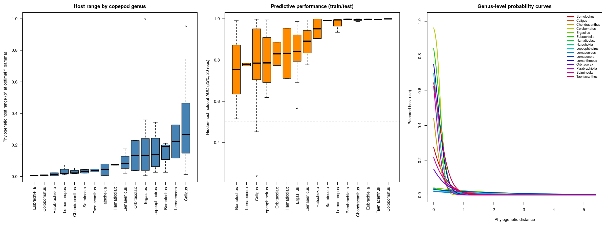
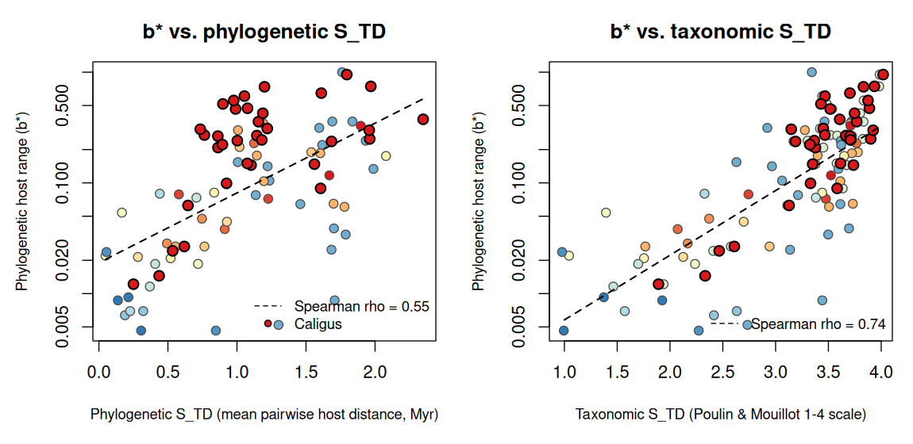
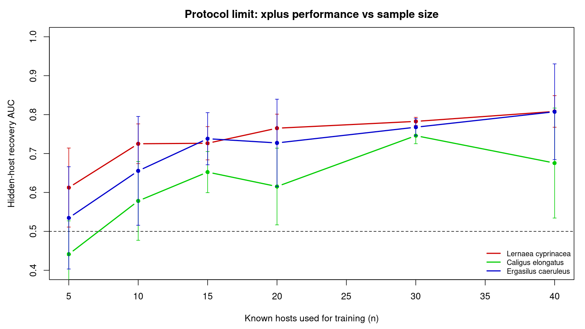

```{r, include = FALSE}
knitr::opts_chunk$set(
  collapse = TRUE,
  comment = "#>",
  fig.width = 7,
  fig.height = 5
)
has_pkgs <- requireNamespace("cofid", quietly = TRUE) &&
  requireNamespace("ape", quietly = TRUE) &&
  requireNamespace("phylopred", quietly = TRUE)
```

This vignette demonstrates the phylopred workflow on a real host-parasite
system, mirroring the copepod case study of the accompanying paper: sea lice
(Copepoda: Caligidae) parasitizing marine fishes. Interaction records come
from the [cofid](https://github.com/alrobles/cofid) package (the curated
copepod-fish interaction database of Morales-Serna 2025) and the host
phylogeny from the [Fish Tree of Life](https://fishtreeoflife.org/) (Rabosky
and colleagues, 2018), pruned to the recorded hosts and shipped as the
`fish_tree` data object. The first sections run the full workflow live on the
two best-sampled sea lice genera, *Caligus* and *Lepeophtheirus*; the final
sections summarize the paper's full 16-genus, 90-parasite analysis.

## 1. Interaction data

We keep one record per copepod species / fish species pair and derive
the copepod genus, which is the clade-level grouping we want to compare.

```{r data, eval = has_pkgs}
interactions <- cofid::cofid
interactions$genus <- sub(" .*", "", interactions$source_taxon_name)
interactions <- interactions[
  interactions$genus %in% c("Caligus", "Lepeophtheirus"),
  c("source_taxon_name", "target_taxon_name", "genus")
]
table(unique(interactions[, c("source_taxon_name", "genus")])$genus)
```

In the paper's analysis *Caligus* is the largest genus (505 unique fish
hosts, 981 records) and *Lepeophtheirus* the third (190 hosts).

## 2. Host phylogenetic distances

The host phylogeny is already pruned to the recorded hosts present in the Fish
Tree of Life; its cophenetic matrix gives the phylogenetic distance between
every pair of hosts.

```{r phydist, eval = has_pkgs}
data(fish_tree, package = "phylopred")
phydist <- cophenetic(fish_tree)
dim(phydist)
```

## 3. Pairwise host-sharing data

`prepare_pair_data()` expands the interaction table into all
(focal host, target host) pairs per parasite. Every known host is used
as a focal host, so the dataset is deterministic and uses all
available information.

```{r pairs, eval = has_pkgs}
# Keep only records whose host is on the tree (309 records are lost to the
# pruning: hosts absent from the Fish Tree of Life cannot be scored)
interactions <- interactions[interactions$target_taxon_name %in%
                               rownames(phydist), ]
pairs <- phylopred::prepare_pair_data(interactions, phydist, group = "genus")
nrow(pairs)
head(pairs)
```

## 4. Comparing slopes between clades

`compare_phylopred_slopes()` fits a single logistic regression with a
genus-by-distance interaction and quantifies uncertainty with a
parasite-level cluster bootstrap.

```{r compare, eval = has_pkgs}
cmp <- phylopred::compare_phylopred_slopes(pairs, n_boot = 20, seed = 42)
cmp
```

The *Lepeophtheirus* slope is steeper than the *Caligus* slope and the
interaction term is negative, supporting the interpretation of
*Lepeophtheirus* as a phylogenetic specialist and *Caligus* as a generalist —
consistent with the paper, where the genus median host range $b^*$ is 0.140
for *Lepeophtheirus* against 0.266 for *Caligus*, the broadest generalist.

## 5. Predicted sharing curves

```{r curves, eval = has_pkgs}
cf <- coef(cmp$fitted_model)
d <- seq(0, max(pairs$phydist), length.out = 200)
p_cal <- plogis(cf["(Intercept)"] + cf["phydist"] * d)
p_lep <- plogis(cf["(Intercept)"] + cf["genusLepeophtheirus"] +
                  (cf["phydist"] + cf["phydist:genusLepeophtheirus"]) * d)
plot(d, p_cal, type = "l", col = "#1b9e77", lwd = 2, ylim = c(0, max(p_cal)),
     xlab = "Host phylogenetic distance",
     ylab = "P(sharing a sea louse)")
lines(d, p_lep, col = "#d95f02", lwd = 2)
legend("topright", legend = c("Caligus (generalist)",
                              "Lepeophtheirus (specialist)"),
       col = c("#1b9e77", "#d95f02"), lwd = 2, bty = "n")
```

## 6. Model capacity and joint uncertainty

`evaluate_phylopred_model()` reports pseudo-R^2 and AUC (optionally with a
parasite-grouped cross-validation, which measures the ability to predict
the host range of unseen parasites), and
`phylopred_confidence_ellipse()` gives the joint confidence region of
intercept and slope from the cluster bootstrap.

```{r evaluate, eval = has_pkgs}
phylopred::evaluate_phylopred_model(pairs)
```

```{r ellipse, eval = has_pkgs}
ell <- phylopred::phylopred_confidence_ellipse(cmp$bootstrap)
plot(ell, type = "l",
     main = "95% joint confidence ellipse (cluster bootstrap)")
points(t(attr(ell, "center")), pch = 19)
```

## 7. Presence-only threshold metrics: f_gamma and partial ROC

Interaction data are presence-only: unrecorded host-parasite pairs are
unlabeled, not true absences. `host_threshold_metric()` adapts the
SDM threshold metric $f_\gamma(t) = a/(\gamma b + c)$ to phylogenies —
`a` is the sensitivity over known hosts and `b` the fraction of all
species in the phylogeny predicted as hosts — and the phylogenetic host
range $b^*$ of the paper is the fraction `b` evaluated at the
$f_\gamma$-optimal threshold.
`phylo_partial_roc()` gives the Peterson-Papes-Soberon partial AUC
ratio against a null (random-ranking) model.

```{r fgamma, eval = has_pkgs}
fit <- glm(suscept ~ phydist, data = pairs, family = binomial())
example_parasite <- names(sort(table(pairs$parasite), decreasing = TRUE))[1]
one <- pairs[pairs$parasite == example_parasite, ]
one$pred <- predict(fit, newdata = one, type = "response")
# Suitability of each target species: best score across the parasite's
# known focal hosts
agg <- aggregate(cbind(pred, suscept) ~ target, data = one, FUN = max)

m <- phylopred::host_threshold_metric(agg$pred, agg$suscept, gamma = 1)
m
plot(m)
```

With `gamma = 1`, `f_gamma` can be read as a phylogenetic efficiency:
known hosts retained per unit of phylogeny predicted as suitable.

In Peterson, Papes and Soberon (2008) the tolerance `E` bounds the
omission error on the y axis, motivated by the known georeferencing /
identification error of occurrence databases. For interaction records we
do not know that error, so `E` is simply the omission we are willing to
tolerate; a large value (here `E = 0.95`) uses essentially the whole
curve, so the ratio compares the full presence-only AUC against the
random-ranking null.

```{r partialroc, eval = has_pkgs}
roc <- phylopred::phylo_partial_roc(agg$pred, agg$suscept, error_rate = 0.95,
                                  n_boot = 200, seed = 42)
roc
plot(roc)
```

## 8. Positive-unlabeled prediction with xplus

The pairwise GLM scores every candidate host through a parametric
curve in phylogenetic distance. `fit_phylopred_pu()` is a parallel,
non-parametric route: known hosts of one parasite are the positives,
every other tip of the phylogeny is unlabeled (not a confirmed
absence), and an iterative PU learner (`xplus`, the PLUS-derived engine of
Zhou and colleagues 2022) is trained on phylogenetic features (minimum and
mean distance to the known hosts plus PCoA axes of the tree).

```{r pu, eval = has_pkgs}
pu <- phylopred::fit_phylopred_pu(interactions, phydist, example_parasite,
                                  seed = 42, max_iter = 30)
pu
m_pu <- phylopred::host_threshold_metric(pu$prediction$pred,
                                         pu$prediction$is_host)
roc_pu <- phylopred::phylo_partial_roc(pu$prediction$pred,
                                     pu$prediction$is_host,
                                     error_rate = 0.95, n_boot = 200,
                                     seed = 42)
roc_pu
```

Because the unlabeled species are not true absences, in-sample
classification metrics overstate performance. `validate_host_prediction()`
hides a fraction of the known hosts, refits, and measures how well the
model ranks the hidden hosts above truly unlabeled species — the
hidden-host recovery AUC reported in the paper.

```{r holdout, eval = has_pkgs}
phylopred::validate_host_prediction(interactions, phydist, example_parasite,
                                    method = "glm", n_rep = 5, seed = 42)
phylopred::validate_host_prediction(interactions, phydist, example_parasite,
                                    method = "pu", n_rep = 5, seed = 42,
                                    max_iter = 20)
```

This holdout AUC is a ranking/recovery score against unlabeled species,
not a classical ROC against confirmed negatives.

## 9. The full copepod analysis: genus ranking and host range

The live sections above show the workflow on two genera; the paper applies
the same machinery to the complete cofid system (90 parasite species with
at least 8 hosts in the tree, 16 genera). The figure below summarizes the
fine sweep: median phylogenetic host range $b^*$ (fraction of the
1,727-species candidate universe scored suitable at the $f_\gamma$-optimal
threshold), median partial-ROC AUC ratio ($E = 0.95$; 1 = null ranking,
2 = perfect), and median hidden-host recovery AUC (25% of hosts hidden,
20 replicates; error bars are the between-replicate SD). The right panel
shows the genus-level probability-of-sharing decay curves; shallower decay
indicates broader phylogenetic host use.

```{r copepod-fine, echo = FALSE, out.width = "100%", fig.cap = "Phylogenetic host range and predictive performance across 16 copepod genera (90 parasite species). Left: median $b^*$ (specialist to generalist gradient). Center: median partial-ROC AUC ratio ($E=0.95$). Right: median hidden-host recovery AUC. Points are genera; bars show the between-replicate standard deviation. See the table below for the full statistics."}

```

```{r genus, echo = FALSE}
genus_data <- data.frame(
  Genus = c("Eubrachiella", "Colobomatus", "Parabrachiella", "Lernanthropus",
            "Chondracanthus", "Salmincola", "Taeniacanthus", "Hatschekia",
            "Hamaticolax", "Lernaeenicus", "Ergasilus", "Orbitacolax",
            "Lepeophtheirus", "Bomolochus", "Lernaeocera", "Caligus"),
  `b*` = c(0.007, 0.009, 0.014, 0.019, 0.022, 0.033, 0.038, 0.043,
           0.075, 0.082, 0.119, 0.133, 0.140, 0.189, 0.222, 0.266),
  `AUC ratio` = c(1.97, 1.99, 1.92, 1.99, 1.97, 1.98, 1.98, 1.96,
                  1.83, 1.85, 1.84, 1.80, 1.68, 1.83, 1.74, 1.71),
  `Holdout AUC` = c(0.998, 0.999, 0.997, 0.994, 0.997, 0.992, 0.998, 0.951,
                    0.833, 0.892, 0.836, 0.830, 0.786, 0.754, 0.778, 0.785),
  SD = c("<0.001", "<0.001", "<0.001", "0.001", "<0.001", "0.008", "<0.001",
         "<0.001", "0.059", "0.030", "0.022", "0.076", "0.021", "0.067",
         "0.123", "0.016"),
  `n parasites` = c(2, 3, 2, 3, 3, 2, 2, 2, 2, 3, 17, 2, 8, 3, 2, 34),
  check.names = FALSE
)
knitr::kable(genus_data,
             caption = "Genus-level medians across parasites (fine sweep: 90
                        parasite species with >= 8 hosts in the tree, 16
                        genera; hidden-host AUC from 20 replicates hiding
                        25% of hosts).")
```

*Lepeophtheirus* (0.140) and *Caligus* (0.266) sit at the generalist half of
the gradient; genus summaries based on only two or three parasites are
illustrative points rather than definitive rankings. Every per-parasite
partial-ROC curve in the study lies above the null diagonal (all bootstrap
p = 0), with genus median ratios from 1.58 (*Lernaea*) and 1.69-1.71
(*Lepeophtheirus*, *Caligus*) to >= 1.97 in the narrow-range genera.

## 10. Comparison with the Poulin and Mouillot $S_{TD}$ specificity index

Across the 90 parasites, $b^*$ correlates positively with both versions of
the Poulin and Mouillot (2003) index: Spearman $\rho = 0.55$
($p = 1.7\times10^{-8}$) against the continuous phylogenetic $S_{TD}$ and
$\rho = 0.74$ ($p = 6.1\times10^{-17}$) against the classic taxonomic
$S_{TD}$. The agreement is not perfect — *Caligus* has the highest median
$b^*$ (0.266) but a lower phylogenetic $S_{TD}$ (1.08) than *Ergasilus*
(1.65) or *Lernaeocera* (1.78) — reflecting a genuine construct difference:
$b^*$ rewards suitability across a large candidate pool at the fitted
threshold, while $S_{TD}$ only measures how far apart the *realized* hosts
are on the tree. Notably, phylogenetic $S_{TD}$ correlates negatively with
both the AUC ratio ($\rho = -0.67$) and the hidden-host recovery AUC
($\rho = -0.69$), so it works as an a priori indicator of how reliable the
phylogenetic-distance model will be for a given parasite.

```{r poulin, echo = FALSE, out.width = "100%", fig.cap = "Phylogenetic host range $b^*$ against the Poulin and Mouillot specificity index $S_{TD}$, as the continuous phylogenetic generalization (left) and the classic taxonomic 1-4 scale (right). Points are individual parasites, colored from specialist (blue) to generalist (red) by genus-level median $b^*$; *Caligus* is outlined because it is the largest genus (34 parasites) and the main case where the two constructs disagree."}

```

## 11. PU learning versus simple phylogenetic baselines

The paper also compared the PU classifier against the simplest rules using
the same information: a nearest-known-host baseline (ranking candidates by
the negative minimum phylogenetic distance to the training hosts, with no
fitting) and a univariate logistic regression on that same distance, on
identical hidden-host splits (100 parasites with >= 8 hosts, 5 replicates
each). The baselines are strong: median hidden-host AUC was 0.870 for
nearest-known-host versus 0.867 for the PU model, and the PU model won in
only 40 of 100 parasites (paired Wilcoxon p = 0.04 in favor of the
baseline). Most interpolation performance in this system is attributable to
raw phylogenetic proximity; the added value of the PU machinery is the
bounded suitability score usable across parasites, the thresholded
host-range summary $b^*$, and the presence-only performance framework.

## 12. Protocol limit: how many known hosts are needed?

Varying the number of training hosts ($n = 5, 10, 15, 20, 30, 40$) for the
best-sampled parasites, the paper found hidden-host AUC near chance
(0.44-0.61) at $n = 5$; the protocol becomes informative around
$n \approx 10$-15 (0.58-0.74) and stabilizes at 0.75-0.81 for $n \ge 30$.
The recommended minimum is 10 known hosts, ideally 15 or more — a stability
zone, not a universal threshold.

```{r protocol-limit, echo = FALSE, out.width = "85%", fig.cap = "Protocol limit: hidden-host recovery AUC as a function of the number of training hosts for the best-sampled parasites. Points are means over 5 replicate subsamples; error bars are the between-replicate standard deviation. The dashed line marks chance level (AUC = 0.5)."}

```

## 13. Predicted novel hosts

The paper's strongest evidence for added value beyond raw proximity is the
set of phylogenetically coherent, testable predictions: *Lepeophtheirus
salmonis* is predicted on unrecorded salmonids (*Hucho* spp.,
*Brachymystax lenok*) and esociforms (*Esox*, *Umbra*), consistent with
reports of sea lice on pike-lineage fishes in brackish water; the flatfish
specialist *L. pectoralis* is predicted on unrecorded *Citharichthys* and
*Paralichthys* flounders; and *Caligus elongatus* extends into unrecorded
monacanthid filefishes adjacent to its recorded hosts. These ranked
candidate lists are hypotheses that field surveys or aquaculture monitoring
can confirm or refute.

## References

- Morales-Serna, F. N. (2025). Global patterns of modularity and narrow host
  use in fish-parasitic copepods (Crustacea). *Biodiversity Data Journal*,
  13, e163693. https://doi.org/10.3897/BDJ.13.e163693 — basis of the cofid
  database.
- Peterson, A. T., Papes, M. & Soberon, J. (2008). Rethinking receiver
  operating characteristic analysis applications in ecological niche
  modeling. *Ecological Modelling*, 213, 63-72.
- Poulin, R. & Mouillot, D. (2003). Parasite specialization from a
  phylogenetic perspective: a new index of host specificity.
  *Parasitology*, 126, 473-480.
- Rabosky, D. L. and colleagues (2018). An inverse latitudinal gradient in
  speciation rate for marine fishes. *Nature*, 559, 392-395.
- Robles-Fernandez, A. L. & Lira-Noriega, A. (2017). Combining phylogenetic
  and occurrence information for risk assessment of pest and pathogen
  interactions with host plants. *Frontiers in Applied Mathematics and
  Statistics*, 3:17. https://doi.org/10.3389/fams.2017.00017
- Tinoco-Dominguez, E., Amancio, G., Robles-Fernandez, A. L. &
  Lira-Noriega, A. (2025). Interaction network of *Phoradendron* and its
  hosts. *American Journal of Botany*, e70025.
- Zhou, J., Lu, X., Chang, W., Wan, C., Lu, X., Zhang, C. & Cao, S. (2022).
  PLUS: Predicting cancer metastasis potential based on positive and
  unlabeled learning. *PLoS Computational Biology*, 18(3), e1009956.
  https://doi.org/10.1371/journal.pcbi.1009956
